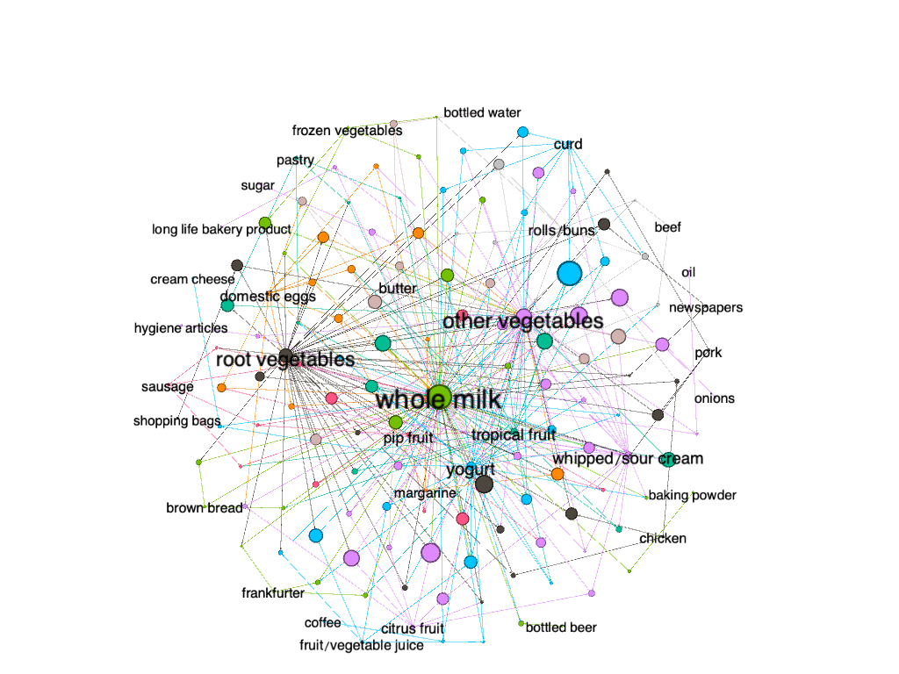

```{r setup, include=FALSE}
knitr::opts_chunk$set(echo = TRUE, dpi = 300)

library(tidyverse)
library(knitr)
library(reshape2)
library(foreach)
library(gridExtra)
library(mosaic)
library(LICORS)
library(arules) 
library(arulesViz)
library(igraph)
theme_set(theme_minimal())
```


## Question 1: Clustering and PCA


### Clustering using K-means++

we use K mean++ initialization to separate the data into 2 different clusters since we are trying to find if the unsupervised algorithm can distinguish to reds from the whites just by looking at the 11 chemicals.

```{r clustering, echo=FALSE}
wine <- read.csv("wine.csv")
### data cleaning 
# Center and scale the data
X = wine[ ,-(12:13)]
X = scale(X, center=TRUE, scale=TRUE)

# Extract the centers and scales from the rescaled data (which are named attributes)
mu = attr(X,"scaled:center")
sigma = attr(X,"scaled:scale")

# Using kmeans++ initialization
clust_wine = kmeanspp(X, k=2, nstart=25)
```


#### First try: using `residual.sugar` and `alcohol`

First, we randomly choose two variables `residual.sugar` and `alcohol` as the axis of the plot to see cluster membership. As the plot shown, with these two variables, it is hard for us to see the cluster membership.

```{r bad cluster, echo=FALSE}
# A few plots with cluster membership shown
# Try some variables not are not gonna look great 
ggplot(wine) + 
  geom_point(aes(residual.sugar, alcohol, color = factor(clust_wine$cluster), shape=factor(clust_wine$cluster)))+
    labs(x ="Residual Sugar", y ="Alcohol ", title = "Cluster Membership")+
          theme(plot.title = element_text(hjust = 0.5, face = "bold"))

```


Unsurprisingly, this way of view the clusters is not good for us to distinguish White from Red as we can see from the plot below:

```{r bad_cluster, echo=FALSE}
ggplot(wine) + 
  geom_point(aes(residual.sugar, alcohol, color = color , shape=factor(clust_wine$cluster)))+   scale_color_manual(values=c("red", "grey"))+ guides(shape =guide_legend(title="Cluster"))+
    labs(x ="Residual Sugar", y ="Alcohol ", title = " Is the Clusters Separating White from Red?")+
          theme(plot.title = element_text(hjust = 0.5, face = "bold"))

```

#### Second try: using `volatile.acidity` and `total.sulfur.dioxide`

Now, we try choosing two other variables `volatile.acidity` and `total.sulfur.dioxide` to see the membership.
```{r good_cluster, echo=FALSE}
# Hand picked 2 variables to make it look good 
# First see how does our clusters look like on a "" v.s "" map
ggplot(wine) + 
  geom_point(aes(volatile.acidity, total.sulfur.dioxide, color = factor(clust_wine$cluster), shape=factor(clust_wine$cluster)))+
    labs(x ="Volatile Acidity ", y ="Total Sulfur Dioxide ", title = "Cluster Membership")+
          theme(plot.title = element_text(hjust = 0.5, face = "bold"))
```


Now again, match the clusters with red/white, we can see this way of viewing the cluster is good for us too distinguish whites from reds

```{r, echo=FALSE}
## NOW, match the clusters with red/white
ggplot(wine) + 
  geom_point(aes(volatile.acidity, total.sulfur.dioxide, color = color , shape=factor(clust_wine$cluster)))+ scale_color_manual(values=c("red", "grey"))+ guides(shape =guide_legend(title="Cluster"))+
    labs(x ="Volatile Acidity", y ="Total Sulfur Dioxide", title = " Is the Clusters Separating White from Red?")+
          theme(plot.title = element_text(hjust = 0.5, face = "bold"))
```


Although this is good at distinguishing whites from reds, it is not too great at distinguishing the quality of the wines.

```{r, echo=FALSE}
# not too great at seperating the quality
ggplot(wine) + 
  geom_point(aes(volatile.acidity, total.sulfur.dioxide, color = quality, shape=factor(clust_wine$cluster)))+ 
  guides(shape =guide_legend(title="Cluster"))+
    labs( title = "Quality of the Wine?")+
          theme(plot.title = element_text(hjust = 0.5, face = "bold"))

```


### PCA

Now, we try running PCA on the data 
```{r PCA, echo=FALSE}
# Now run PCA on the  data
pc_wine = prcomp(X, rank=5, scale=TRUE)
loadings = pc_wine$rotation
scores = pc_wine$x

```


we can briefly look through the linear combinations of data that define the PCs, each column is a different linear summary of the 11 chemicals.

```{r PCA -2, echo=FALSE}
# these are the linear combinations of data that define the PCs
# each column is a different linear summary of the 11 chemicals 
kable(head(loadings))
```


5 summary features gets us 80% of the overall variation in the 11 original features. Although the compression ratio does not look great, it is sufficient to distinguish reds and whites. 

```{r PCA -3, echo=FALSE}
# 5 summary features gets us 80% of the overall variation in the 11 original features
# although the compression ratio does not look great, it is sufficient to dsitinguish reds and whites 
summary(pc_wine)


qplot(scores[,1], scores[,2], color=wine$color, xlab='Component 1', ylab='Component 2') + scale_color_manual(values=c("red", "grey"))
```


But it is still very hard to tell the quality of the wine from PCs.


```{r PCA -4, echo=FALSE}
# The PCA separates the color of the wine well
# but not the quality of the wine
qplot(scores[,1], scores[,3], color=wine$quality, xlab='Component 1', ylab='Component 3')

```

### Conclusion
using PCA would be more efficient in distinguishing the reds from the whites since we don't need to choose to see the clusters on map that is constructed by which two of the variables. On the other hand, using PCA would allow us to distinguish the reds from the whites just by using the two principle components. Another thing we could notice is that none of these two unsupervised learning algorithms is capable of distinguishing the higher from the lower quality wines.


## Question 2: Market segmentation

### K-means clustering
```{r, echo=FALSE, warning=FALSE, message=FALSE, fig.width=12, fig.height=12}

set.seed(748737737) 

##### Clustering with K-Means
social = read.csv("social_marketing.csv")
X = social[,-(1)]
X = scale(X, center=TRUE, scale=TRUE)
mu = attr(X,"scaled:center")
sigma = attr(X,"scaled:scale")


ggcorrplot::ggcorrplot(cor(X), hc.order = TRUE)
```
Doing a quick correlation plot, we can see the tweet categories that are most associated with each other for a given user.

Next we'll cluster using K-means to potentially find interesting subsets of Twitter followers based on their frequency of tweets in certain categories. But first, we'll have to pick the optimal amount of clusters given that the tweets are categorized into many different variables.

```{r, echo=FALSE, warning=FALSE, message=FALSE, out.width="50%", out.height="50%"}

#Lets first pick optimal K
k_grid = seq(2, 30, by=1)
SSE_grid = foreach(k = k_grid, .combine='c') %do% {
  cluster_k = kmeans(X, k, nstart=25)
  cluster_k$tot.withinss
}

plot(k_grid, SSE_grid, main = "Elbow Plot")

```


We'll pick 11 clusters because it seems to be the closest thing to an "elbow" point.

```{r, echo=FALSE, warning=FALSE, message=FALSE}

# we'll pick k because it seems to be the closest thing to an elbow point
clust1 = kmeans(X, 11, nstart=25)
#clust1$tot.withinss 
#180158.8

## this next section is to categorize everything so I'll put these into an easily readable dataframe
df = data.frame(
  cluster1 = c(clust1$center[1,]*sigma + mu),
  cluster2 = c(clust1$center[2,]*sigma + mu),
  cluster3 = c(clust1$center[3,]*sigma + mu),
  cluster4 = c(clust1$center[4,]*sigma + mu),
  cluster5 = c(clust1$center[5,]*sigma + mu),
  cluster6 = c(clust1$center[6,]*sigma + mu),
  cluster7 = c(clust1$center[7,]*sigma + mu),
  cluster8 = c(clust1$center[8,]*sigma + mu),
  cluster9 = c(clust1$center[9,]*sigma + mu),
  cluster10 = c(clust1$center[10,]*sigma + mu),
  cluster11 = c(clust1$center[11,]*sigma + mu)
)

#transpose for readaability and reshape it
df = data.frame(
  cluster = c(1:11),
  t(df)
)


rownames(df) = 1:nrow(df)
df_melt <- melt(df, id.vars='cluster')

# we'll select the top 5 tweet categories to see what type of user is in each cluster
top_5 = df_melt %>% 
  group_by(cluster) %>%
  arrange(cluster, desc(value)) %>%
  slice_max(order_by = value, n=5)

t1 = top_5 %>% filter(cluster == 1) # College aged gamers
t2 = top_5 %>% filter(cluster == 2) # informed news folks with politics and (cars for some reason. maybe conservatives?...or m e n)
t3 = top_5 %>% filter(cluster == 3) # pornography/nsfw?
t4 = top_5 %>% filter(cluster == 4) # cooking, photo sharing, fashion, beauty, gossip. a type of influencer i think
t5 = top_5 %>% filter(cluster == 5) # dating, talk/gossip. I think influencers/life advice crowd?
t6 = top_5 %>% filter(cluster == 6) # health and fitness crowd
t7 = top_5 %>% filter(cluster == 7) # politics and travel. But I think foreign policy focused folks
t8 = top_5 %>% filter(cluster == 8) # sports, religion, parenting. probably stay at home parents.
t9 = top_5 %>% filter(cluster == 9) # entertainment culture art crowd
t10 = top_5 %>% filter(cluster == 10) # miscellaneous
t11 = top_5 %>% filter(cluster == 11) #my guess is memes. shopping (ads?) photo sharing and chatter


knitr::kables(list(kable(t1[c("variable", "value")], caption = "Cluster 1", digits=3),
                   kable(t2[c("variable", "value")], caption="Cluster 2", digits=3),
                   kable(t3[c("variable", "value")], caption="Cluster 3", digits=3),
                   kable(t4[c("variable", "value")], caption = "Cluster 4", digits=3)
                   )
              )
knitr::kables(list(kable(t5[c("variable", "value")], caption="Cluster 5", digits=3),
                   kable(t6[c("variable", "value")], caption="Cluster 6", digits=3),
                   kable(t7[c("variable", "value")], caption="Cluster 7", digits=3),
                   kable(t8[c("variable", "value")], caption="Cluster 8", digits=3)
                   )
              )
knitr::kables(list(kable(t9[c("variable", "value")], caption="Cluster 9", digits=3),
                   kable(t10[c("variable", "value")], caption="Cluster 10", digits=3),
                   kable(t11[c("variable", "value")], caption="Cluster 11", digits=3)
                   )
              )

```

Here, we have our 11 clusters. We filtered for the top 5 categories of tweets for each cluster. We can mostly see clearly defined groups of people that seem to make sense. For example: Cluster 9 would be a crowd of users that are college aged video game players. More interestingly, Cluster 11 would be a group of users that primarily tweet about health and fitness.

### PCA

Next, we'll try PCA to see if we can find any more combination of variables that can explain the users, that wasn't revealed through clustering.

```{r echo=FALSE, message=FALSE, warning=FALSE, fig.width=13, fig.height=13}

### PCA
pca_social = prcomp(X, rank=11, scale=TRUE)
loadings = pca_social$rotation

head(loadings)
summary(pca_social)


loadings_summary = loadings %>%
  as.data.frame() %>%
  rownames_to_column('Categories')


pc1_ = ggplot(loadings_summary) + geom_col(aes(x=reorder(Categories, PC1), y=PC1)) + coord_flip()
pc2_ = ggplot(loadings_summary) + geom_col(aes(x=reorder(Categories, PC2), y=PC2)) + coord_flip()
pc3_ = ggplot(loadings_summary) + geom_col(aes(x=reorder(Categories, PC3), y=PC3)) + coord_flip()
pc4_ = ggplot(loadings_summary) + geom_col(aes(x=reorder(Categories, PC4), y=PC4)) + coord_flip()
pc5_ = ggplot(loadings_summary) + geom_col(aes(x=reorder(Categories, PC5), y=PC5)) + coord_flip()
pc6_ = ggplot(loadings_summary) + geom_col(aes(x=reorder(Categories, PC6), y=PC6)) + coord_flip()
pc7_ = ggplot(loadings_summary) + geom_col(aes(x=reorder(Categories, PC7), y=PC7)) + coord_flip()
pc8_ = ggplot(loadings_summary) + geom_col(aes(x=reorder(Categories, PC8), y=PC8)) + coord_flip()
pc9_ = ggplot(loadings_summary) + geom_col(aes(x=reorder(Categories, PC9), y=PC9)) + coord_flip()
pc10_ = ggplot(loadings_summary) + geom_col(aes(x=reorder(Categories, PC10), y=PC10)) + coord_flip()
pc11_ = ggplot(loadings_summary) + geom_col(aes(x=reorder(Categories, PC11), y=PC11)) + coord_flip()

grid.arrange(pc1_, pc2_, pc3_, pc4_, pc5_, pc6_, pc7_, pc8_, pc9_, pc10_, pc11_) 

```

Running PCA shows some of the same categories of users that we found with the clustering method, and some other ones, such as music twitter. Also interestingly found some two subsets of Film/TV twitter users: one on the more artistic side and the other more business/industry oriented. The brand clearly has a wide variety of followers, and obviously they should try to appeal to the cooking or the health/fitness crowd. But beverage preference is so personal that they could run a variety of targeted ads that appeal to each category of Twitter user. The ads can be made to use or avoid certain phrases or words based on each cluster or principal component. For example: ads that target the "TV/Film and Art" crowd (Look at PC7) can avoid appeals to online gaming, cars, or sports.

## Question 3: Association rules for grocery purchases

  Initially, it seemed like the best option to include relatively high thresholds for both support and confidence. This approach seems to make sense, because support can tell us what rules are worth exploring further. However, when using a minimum support threshold of .005 and confidence of .5 we didn't seem to get very show-stopping results. Simply put, we basically determined that people buy whole milk and "other vegetables" when they buy other items. Given the sheer popularity of milk and vegetables, this isn't a very compelling or interesting result. Max item length was set at 10, this is because people typically purchase a lot of items at once when grocery shopping, and we didn't want to miss any potentially interesting combinations. 

  The confidence threshold was set at .5, which may seem high, but setting confidence higher was done to offset the "milk" factor and to truly extract surprising results. Because milk is such popular item, many rules that involve milk and another item will have high confidence even if the lift isn't very high. 

  After the disappointing results using .005 minimum support, we adjusted our minimum support to be .001 while keeping confidence and max item length the same. After extracting the rules, we looked at rules with a lift > 10 and this resulted in some interesting, but not entirely surprising associations. 

**The 15 rules with lift greater than 10 are listed below:**


```{r 3A, results = FALSE, message=FALSE, echo=FALSE}

#import data, tab delimited text file
raw_groceries <- read.table("groceries.txt", 
                            sep = '\t', header = F)

#add a numbered variable to keep track of baskets
raw_groceries <- raw_groceries %>%
 add_column(Basket_Number= NA) 
raw_groceries$Basket_Number <- 1:nrow(raw_groceries) 

#rename first variable
raw_groceries <- rename(raw_groceries, Customer = V1)

raw_groceries$Basket_Number = factor(raw_groceries$Basket_Number)

#commas into individual items
groceries = strsplit(raw_groceries$Customer, ",")

groceries$Customer = factor(groceries$Customer)


# Remove duplicates ("de-dupe")
# lapply says "apply a function to every element in a list"
# unique says "extract the unique elements" (i.e. remove duplicates)
groceries = lapply(groceries, unique)

grocerytrans = as(groceries, "transactions")

groceryrules = apriori(grocerytrans, 
                     parameter=list(support=.001, confidence=.5, maxlen=10))

grocrules_df <- arules::DATAFRAME(groceryrules)

data_frame_mod <- filter(grocrules_df,lift>10)

sub1 = subset(groceryrules, subset = confidence > 0.01 & support > 0.005)

saveAsGraph(sub1, file = "groceryrules.graphml")
```

```{r 3B, message=FALSE, echo=FALSE}
kable(data_frame_mod[1:15, ], caption = "Rules with lift over 10")
```

**Looking at many of the rules, it's clear that some are compliments such as:**
  
  `{ham, processed cheese} -> white bread`
  
  `{baking powder, flour} -> sugar`
  
  **Other rules might not initially seem like complements, but have clear associations with each other. The rule with the highest lift seems to come from people planning parties or cookouts:**
  
  `{instant food products, soda} -> hamburger meat` 
  
This rule has the highest lift of all the rules we found with 18.998 lift, and may indicate people buying products for cookouts.
  
  `{liquor, red/blush wine} -> bottled beer`
  
  This rule makes sense for parties, it also has a very high confidence of 0.9047619.
  
  `{popcorn, soda} -> salty snack` 
  
  This rule makes sense because people buy these items for parties and movie nights
  
  **Finally, the most amusing rule may be:**
  
  `{Instant food products, whole milk} -> hamburger meat` 
  
  This rule may be comprised of people buying the ingredients for the American household staple Hamburger Helper, which requires instant Hamburger Helper mix, milk, and hamburger meat.  
  
### Graphs

Below are some plots illustrating the ruleset created in the first part of the question.

Plot 1 shows rules organized by support and lift, with shade intensity representing confidence.

Plot 2 shows rules organized support and confidence with different colors representing the order of specific rules.

Plot 3 shows a network plot of rules with confidence > 0.01 and support > 0.005, this was done to make the network more presentable, trying to plot all of the rules creates a messy and un-interpretable network. 
  
```{r 3C, message=FALSE, echo=FALSE}

plot(groceryrules, measure = c("support", "lift"), shading = "confidence")

# "two key" plot: coloring is by size (order) of item set
plot(groceryrules, method='two-key plot')
```

```{r, message=FALSE, echo=FALSE, dpi=100}

```
