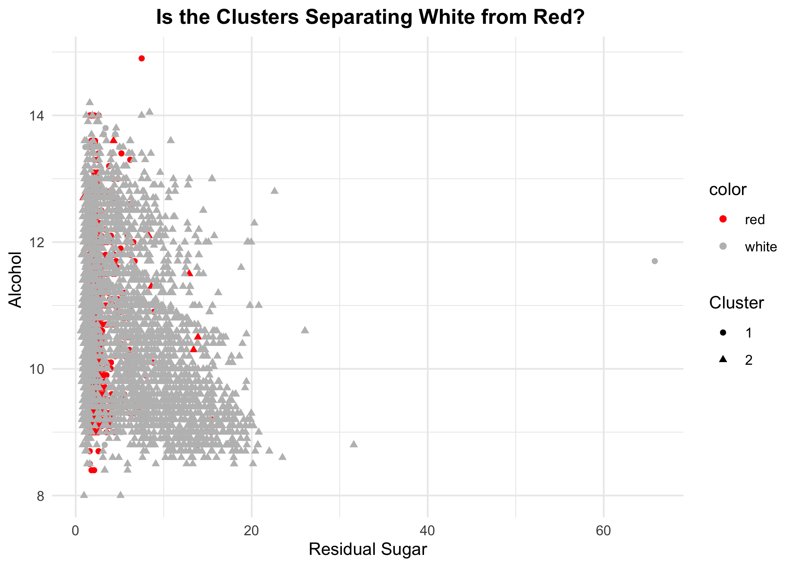
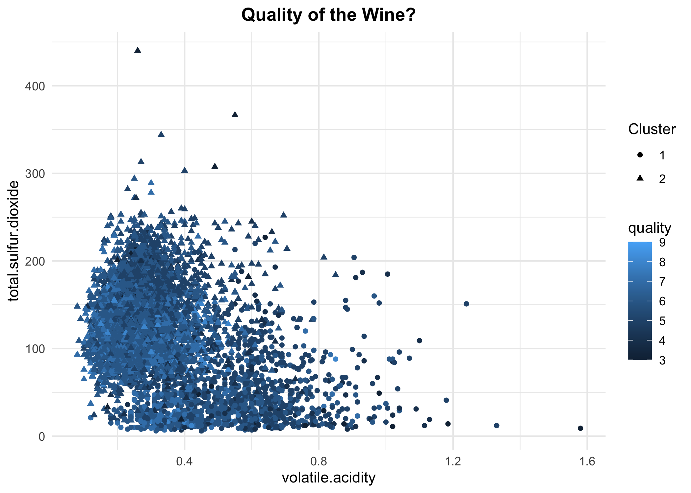

## Question 1: Clustering and PCA

### Clustering using K-means++

we use K mean++ initialization to separate the data into 2 different
clusters since we are trying to find if the unsupervised algorithm can
distinguish to reds from the whites just by looking at the 11 chemicals.

#### First try: using `residual.sugar` and `alcohol`

First, we randomly choose two variables `residual.sugar` and `alcohol`
as the axis of the plot to see cluster membership. As the plot shown,
with these two variables, it is hard for us to see the cluster
membership.

Unsurprisingly, this way of view the clusters is not good for us to
distinguish White from Red as we can see from the plot below:

#### Second try: using `volatile.acidity` and `total.sulfur.dioxide`

Now, we try choosing two other variables `volatile.acidity` and
`total.sulfur.dioxide` to see the membership.

Now again, match the clusters with red/white, we can see this way of
viewing the cluster is good for us too distinguish whites from reds

Although this is good at distinguishing whites from reds, it is not too
great at distinguishing the quality of the wines.

### PCA

Now, we try running PCA on the data

we can briefly look through the linear combinations of data that define
the PCs, each column is a different linear summary of the 11 chemicals.

|                     |        PC1 |       PC2 |        PC3 |        PC4 |        PC5 |
|:--------------------|-----------:|----------:|-----------:|-----------:|-----------:|
| fixed.acidity       | -0.2387989 | 0.3363545 | -0.4343013 |  0.1643462 | -0.1474804 |
| volatile.acidity    | -0.3807575 | 0.1175497 |  0.3072594 |  0.2127849 |  0.1514560 |
| citric.acid         |  0.1523884 | 0.1832994 | -0.5905697 | -0.2643003 | -0.1553487 |
| residual.sugar      |  0.3459199 | 0.3299142 |  0.1646884 |  0.1674430 | -0.3533619 |
| chlorides           | -0.2901126 | 0.3152580 |  0.0166791 | -0.2447439 |  0.6143911 |
| free.sulfur.dioxide |  0.4309140 | 0.0719326 |  0.1342239 | -0.3572789 |  0.2235323 |

5 summary features gets us 80% of the overall variation in the 11
original features. Although the compression ratio does not look great,
it is sufficient to distinguish reds and whites.

    ## Importance of first k=5 (out of 11) components:
    ##                           PC1    PC2    PC3     PC4     PC5
    ## Standard deviation     1.7407 1.5792 1.2475 0.98517 0.84845
    ## Proportion of Variance 0.2754 0.2267 0.1415 0.08823 0.06544
    ## Cumulative Proportion  0.2754 0.5021 0.6436 0.73187 0.79732

But it is still very hard to tell the quality of the wine from PCs.

### Conclusion

using PCA would be more efficient in distinguishing the reds from the
whites since we don’t need to choose to see the clusters on map that is
constructed by which two of the variables. On the other hand, using PCA
would allow us to distinguish the reds from the whites just by using the
two principle components. Another thing we could notice is that none of
these two unsupervised learning algorithms is capable of distinguishing
the higher from the lower quality wines.

## Question 2: Market segmentation

### K-means clustering

Doing a quick correlation plot, we can see the tweet categories that are
most associated with each other for a given user.

Next we’ll cluster using K-means to potentially find interesting subsets
of Twitter followers based on their frequency of tweets in certain
categories. But first, we’ll have to pick the optimal amount of clusters
given that the tweets are categorized into many different variables.

We’ll pick 11 clusters because it seems to be the closest thing to an
“elbow” point.

<table class="kable_wrapper">
<tbody>
<tr>
<td>

| variable       |  value |
|:---------------|-------:|
| college_uni    | 11.097 |
| online_gaming  | 10.897 |
| chatter        |  4.051 |
| sports_playing |  2.751 |
| photo_sharing  |  2.646 |

Cluster 1

</td>
<td>

| variable      | value |
|:--------------|------:|
| news          | 6.838 |
| politics      | 5.518 |
| automotive    | 4.399 |
| chatter       | 4.116 |
| sports_fandom | 3.064 |

Cluster 2

</td>
<td>

| variable         | value |
|:-----------------|------:|
| adult            | 7.204 |
| chatter          | 4.653 |
| health_nutrition | 2.796 |
| photo_sharing    | 2.449 |
| politics         | 2.245 |

Cluster 3

</td>
<td>

| variable      |  value |
|:--------------|-------:|
| cooking       | 11.755 |
| photo_sharing |  6.073 |
| fashion       |  5.989 |
| beauty        |  4.223 |
| chatter       |  4.180 |

Cluster 4

</td>
</tr>
</tbody>
</table>
<table class="kable_wrapper">
<tbody>
<tr>
<td>

| variable      | value |
|:--------------|------:|
| dating        | 9.309 |
| chatter       | 7.943 |
| photo_sharing | 2.624 |
| fashion       | 2.510 |
| school        | 2.263 |

Cluster 5

</td>
<td>

| variable         |  value |
|:-----------------|-------:|
| health_nutrition | 12.619 |
| personal_fitness |  6.657 |
| chatter          |  3.796 |
| cooking          |  3.423 |
| outdoors         |  2.903 |

Cluster 6

</td>
<td>

| variable  |  value |
|:----------|-------:|
| politics  | 11.300 |
| travel    |  9.120 |
| computers |  4.090 |
| chatter   |  4.067 |
| news      |  3.633 |

Cluster 7

</td>
<td>

| variable      | value |
|:--------------|------:|
| sports_fandom | 6.158 |
| religion      | 5.516 |
| food          | 4.726 |
| parenting     | 4.239 |
| chatter       | 3.840 |

Cluster 8

</td>
</tr>
</tbody>
</table>
<table class="kable_wrapper">
<tbody>
<tr>
<td>

| variable      | value |
|:--------------|------:|
| tv_film       | 5.622 |
| art           | 5.042 |
| chatter       | 3.936 |
| college_uni   | 2.572 |
| photo_sharing | 2.464 |

Cluster 9

</td>
<td>

| variable         | value |
|:-----------------|------:|
| chatter          | 3.079 |
| photo_sharing    | 1.546 |
| current_events   | 1.266 |
| health_nutrition | 1.146 |
| travel           | 1.084 |

Cluster 10

</td>
<td>

| variable         | value |
|:-----------------|------:|
| chatter          | 9.725 |
| photo_sharing    | 5.981 |
| shopping         | 4.133 |
| current_events   | 1.987 |
| health_nutrition | 1.597 |

Cluster 11

</td>
</tr>
</tbody>
</table>

Here, we have our 11 clusters. We filtered for the top 5 categories of
tweets for each cluster. We can mostly see clearly defined groups of
people that seem to make sense. For example: Cluster 9 would be a crowd
of users that are college aged video game players. More interestingly,
Cluster 11 would be a group of users that primarily tweet about health
and fitness.

### PCA

Next, we’ll try PCA to see if we can find any more combination of
variables that can explain the users, that wasn’t revealed through
clustering.

    ##                        PC1        PC2         PC3         PC4          PC5
    ## chatter        -0.12599239 0.19722550 -0.07480685  0.11283140 -0.192781993
    ## current_events -0.09723669 0.06403650 -0.05223971  0.02984859 -0.058189804
    ## travel         -0.11664903 0.03994727 -0.42425971 -0.14542839 -0.007837204
    ## photo_sharing  -0.18027952 0.30307763  0.01070950  0.15149099 -0.229660594
    ## uncategorized  -0.09443507 0.14649886  0.03054185  0.01924574  0.061021189
    ## tv_film        -0.09745666 0.07935251 -0.08620960  0.08993069  0.210237964
    ##                        PC6         PC7         PC8         PC9        PC10
    ## chatter         0.46104948 -0.10773067  0.07085992 -0.01633678  0.10707208
    ## current_events  0.13943410  0.03730454 -0.05464227 -0.01979920 -0.11211526
    ## travel         -0.16357096  0.08503903  0.30690555  0.01925498 -0.10595217
    ## photo_sharing   0.21136713 -0.12650667  0.02220056  0.01631404 -0.13130370
    ## uncategorized  -0.03560916  0.18737831 -0.04908750 -0.05361308  0.26697503
    ## tv_film         0.06179212  0.50476369 -0.22004246  0.12839252 -0.09573967
    ##                       PC11
    ## chatter        -0.00470182
    ## current_events  0.02638837
    ## travel         -0.01325398
    ## photo_sharing  -0.08005783
    ## uncategorized   0.35876853
    ## tv_film         0.04272020

    ## Importance of first k=11 (out of 36) components:
    ##                           PC1     PC2     PC3     PC4     PC5     PC6     PC7
    ## Standard deviation     2.1186 1.69824 1.59388 1.53457 1.48027 1.36885 1.28577
    ## Proportion of Variance 0.1247 0.08011 0.07057 0.06541 0.06087 0.05205 0.04592
    ## Cumulative Proportion  0.1247 0.20479 0.27536 0.34077 0.40164 0.45369 0.49961
    ##                            PC8     PC9    PC10    PC11
    ## Standard deviation     1.19277 1.15127 1.06930 1.00566
    ## Proportion of Variance 0.03952 0.03682 0.03176 0.02809
    ## Cumulative Proportion  0.53913 0.57595 0.60771 0.63580

Running PCA shows some of the same categories of users that we found
with the clustering method, and some other ones, such as music twitter.
Also interestingly found some two subsets of Film/TV twitter users: one
on the more artistic side and the other more business/industry oriented.
The brand clearly has a wide variety of followers, and obviously they
should try to appeal to the cooking or the health/fitness crowd. But
beverage preference is so personal that they could run a variety of
targeted ads that appeal to each category of Twitter user. The ads can
be made to use or avoid certain phrases or words based on each cluster
or principal component. For example: ads that target the “TV/Film and
Art” crowd (Look at PC7) can avoid appeals to online gaming, cars, or
sports.

## Question 3: Association rules for grocery purchases

Initially, it seemed like the best option to include relatively high
thresholds for both support and confidence. This approach seems to make
sense, because support can tell us what rules are worth exploring
further. However, when using a minimum support threshold of .005 and
confidence of .5 we didn’t seem to get very show-stopping results.
Simply put, we basically determined that people buy whole milk and
“other vegetables” when they buy other items. Given the sheer popularity
of milk and vegetables, this isn’t a very compelling or interesting
result. Max item length was set at 10, this is because people typically
purchase a lot of items at once when grocery shopping, and we didn’t
want to miss any potentially interesting combinations.

The confidence threshold was set at .5, which may seem high, but setting
confidence higher was done to offset the “milk” factor and to truly
extract surprising results. Because milk is such popular item, many
rules that involve milk and another item will have high confidence even
if the lift isn’t very high.

After the disappointing results using .005 minimum support, we adjusted
our minimum support to be .001 while keeping confidence and max item
length the same. After extracting the rules, we looked at rules with a
lift \> 10 and this resulted in some interesting, but not entirely
surprising associations.

**The 15 rules with lift greater than 10 are listed below:**

| LHS                                                                     | RHS              |   support | confidence |  coverage |     lift | count |
|:------------------------------------------------------------------------|:-----------------|----------:|-----------:|----------:|---------:|------:|
| {liquor,red/blush wine}                                                 | {bottled beer}   | 0.0019317 |  0.9047619 | 0.0021350 | 11.23641 |    19 |
| {popcorn,soda}                                                          | {salty snack}    | 0.0012200 |  0.6315789 | 0.0019317 | 16.69949 |    12 |
| {Instant food products,soda}                                            | {hamburger meat} | 0.0012200 |  0.6315789 | 0.0019317 | 18.99759 |    12 |
| {Instant food products,whole milk}                                      | {hamburger meat} | 0.0015250 |  0.5000000 | 0.0030500 | 15.03976 |    15 |
| {ham,processed cheese}                                                  | {white bread}    | 0.0019317 |  0.6333333 | 0.0030500 | 15.04702 |    19 |
| {domestic eggs,processed cheese}                                        | {white bread}    | 0.0011183 |  0.5238095 | 0.0021350 | 12.44490 |    11 |
| {baking powder,flour}                                                   | {sugar}          | 0.0010167 |  0.5555556 | 0.0018300 | 16.40974 |    10 |
| {hard cheese,whipped/sour cream,yogurt}                                 | {butter}         | 0.0010167 |  0.5882353 | 0.0017283 | 10.61630 |    10 |
| {hamburger meat,whipped/sour cream,yogurt}                              | {butter}         | 0.0010167 |  0.6250000 | 0.0016267 | 11.27982 |    10 |
| {sliced cheese,tropical fruit,whole milk,yogurt}                        | {butter}         | 0.0010167 |  0.5555556 | 0.0018300 | 10.02650 |    10 |
| {cream cheese ,other vegetables,whipped/sour cream,yogurt}              | {curd}           | 0.0010167 |  0.5882353 | 0.0017283 | 11.04176 |    10 |
| {curd,other vegetables,whipped/sour cream,yogurt}                       | {cream cheese }  | 0.0010167 |  0.5882353 | 0.0017283 | 14.83560 |    10 |
| {other vegetables,tropical fruit,white bread,yogurt}                    | {butter}         | 0.0010167 |  0.6666667 | 0.0015250 | 12.03180 |    10 |
| {other vegetables,rolls/buns,root vegetables,tropical fruit,whole milk} | {beef}           | 0.0011183 |  0.5500000 | 0.0020333 | 10.48411 |    11 |
| {domestic eggs,other vegetables,tropical fruit,whole milk,yogurt}       | {butter}         | 0.0010167 |  0.6250000 | 0.0016267 | 11.27982 |    10 |

Rules with lift over 10

**Looking at many of the rules, it’s clear that some are compliments
such as:**

`{ham, processed cheese} -> white bread`

`{baking powder, flour} -> sugar`

**Other rules might not initially seem like complements, but have clear
associations with each other. The rule with the highest lift seems to
come from people planning parties or cookouts:**

`{instant food products, soda} -> hamburger meat`

This rule has the highest lift of all the rules we found with 18.998
lift, and may indicate people buying products for cookouts.

`{liquor, red/blush wine} -> bottled beer`

This rule makes sense for parties, it also has a very high confidence of
0.9047619.

`{popcorn, soda} -> salty snack`

This rule makes sense because people buy these items for parties and
movie nights

**Finally, the most amusing rule may be:**

`{Instant food products, whole milk} -> hamburger meat`

This rule may be comprised of people buying the ingredients for the
American household staple Hamburger Helper, which requires instant
Hamburger Helper mix, milk, and hamburger meat.

### Graphs

Below are some plots illustrating the ruleset created in the first part
of the question.

Plot 1 shows rules organized by support and lift, with shade intensity
representing confidence.

Plot 2 shows rules organized support and confidence with different
colors representing the order of specific rules.

Plot 3 shows a network plot of rules with confidence \> 0.01 and support
\> 0.005, this was done to make the network more presentable, trying to
plot all of the rules creates a messy and un-interpretable network.

